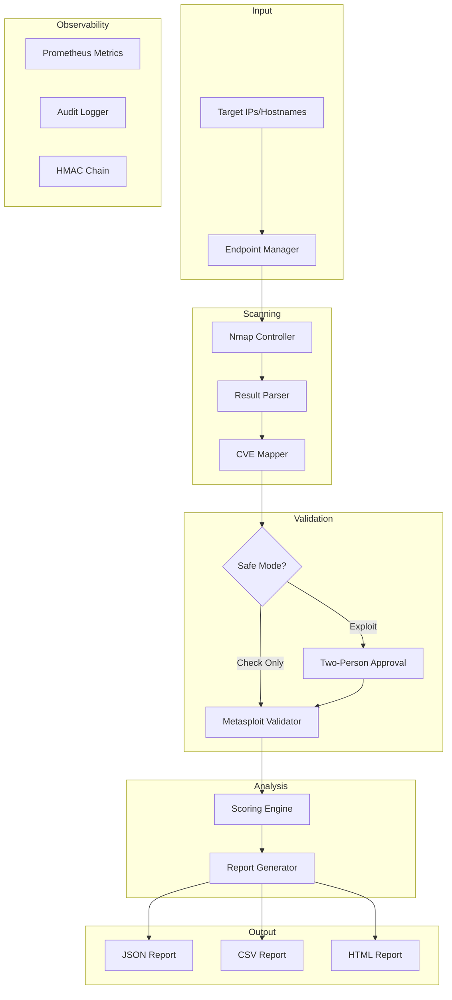

# 🔍 Network Vulnerability Scanner

<div align="center">


**Production-grade automated vulnerability-scanning framework combining Nmap reconnaissance with Metasploit exploitation validation and intelligent threat prioritization.**

[Features](#-features) • [Quick Start](#-quick-start) • [Architecture](#-architecture) • [Usage](#-usage) • [Security](#-security) • [Testing](#-testing)

</div>

---

## ✨ Features

| Feature                     | Description                                                                              |
|-----------------------------|------------------------------------------------------------------------------------------|
| 🔎 **Nmap Integration**      | Automated scanning with version detection, OS fingerprinting, and vulnerability scripts |
| 🛡️ **Metasploit Validation** | Verify exploitability via RPC API (safe check mode by default)                          |
| 📊 **Threat Prioritization** | `Score = CVSS × Exploit Probability × Asset Weight - FP Factor`                         |
| 👥 **Two-Person Approval**   | Destructive tests require dual authorization with unique device fingerprints            |
| 📝 **HMAC Audit Trail**      | Tamper-evident logging with cryptographic chain verification                            |
| 📈 **Prometheus Metrics**    | Full observability with Grafana dashboards                                              |
| 🔐 **RBAC**                  | Role-based access control (Viewer, Operator, Admin)                                     |
| 🚨 **Kill Switch**           | Emergency stop for all active scans                                                     |

---

## 🚀 Quick Start

### Prerequisites

- Python 3.11+
- Nmap 7.94+ installed (`brew install nmap` on macOS)
- (Optional) Metasploit Framework for exploit validation

### Installation

```bash
# Clone the repository
git clone https://github.com/yourusername/Network_Vuln.git
cd Network_Vuln

# Create virtual environment
python -m venv venv
source venv/bin/activate  # On Windows: venv\Scripts\activate

# Install dependencies
pip install -r requirements.txt
```

### Your First Scan

```bash
# Quick scan (no root required)
python main.py scan \
  --target scanme.nmap.org \
  --user-id operator1 \
  --ticket-id VULN-0001 \
  --scan-type quick

# Full scan with vulnerability detection (requires sudo)
sudo python main.py scan \
  --target 192.168.1.100 \
  --user-id operator1 \
  --ticket-id VULN-0001 \
  --scan-type full
```

---

## 🏗️ Architecture



### Data Flow

```
┌─────────────────┐     ┌─────────────────┐     ┌─────────────────┐
│    Endpoint     │────▶│      Nmap       │────▶│     Result      │
│    Manager      │     │   Controller    │     │     Parser      │
└─────────────────┘     └─────────────────┘     └─────────────────┘
                                                        │
                        ┌─────────────────┐             ▼
                        │     Report      │◀────┌─────────────────┐
                        │    Generator    │     │    Scoring      │
                        └─────────────────┘     │     Engine      │
                                                └─────────────────┘
                                                        ▲
┌─────────────────┐     ┌─────────────────┐             │
│   Safe Mode     │────▶│   Metasploit    │─────────────┘
│   Controller    │     │    Validator    │
└─────────────────┘     └─────────────────┘
```

---

## 📖 Usage

### CLI Commands

#### Scan Targets

```bash
# Scan by IP address
python main.py scan --target 10.0.0.1 --user-id admin --ticket-id VULN-001

# Scan by hostname (auto-resolved)
python main.py scan --target scanme.nmap.org --user-id admin --ticket-id VULN-001

# Scan from file
python main.py scan --targets-file hosts.csv --user-id admin --ticket-id VULN-001
```

#### Scan Types

| Type      | Arguments                                      | Root Required | Description                    |
|-----------|------------------------------------------------|---------------|--------------------------------|
| `quick`   | `-sV -T4 --top-ports 100`                      | No            | Fast service version detection |
| `full`    | `-sV -O --script vuln,version -T2`             | Yes           | Complete vulnerability scan    |
| `stealth` | `-sS -T1 --script safe`                        | Yes           | Low-profile SYN scan           |
| `vuln`    | `-sV --script vuln -T2`                        | No            | Vulnerability scripts only     |

#### Validate Vulnerabilities

```bash
python main.py validate \
  --target 10.0.0.1 \
  --module exploit/windows/smb/ms17_010 \
  --user-id admin \
  --ticket-id VULN-001
```

#### Generate Reports

```bash
# All formats
python main.py report --scan-id abc123 --format all

# Specific format
python main.py report --scan-id abc123 --format html --output ./my-reports
```

#### Check Status

```bash
python main.py status
```

---

## 🔐 Security

### Security Requirements

| Requirement            | Implementation                                          |
|------------------------|---------------------------------------------------------|
| **msfrpcd Access**     | mTLS proxy (Envoy), localhost bind only                 |
| **Secrets Management** | Vault (AppRole/OIDC), no env vars in production         |
| **Exploit Mode**       | Two-person approval enforced in code                    |
| **Audit Trail**        | HMAC chain with Vault key, external timestamp anchoring |
| **Database**           | PostgreSQL with TLS, role-based access                  |

### Two-Person Approval

Destructive exploit actions require approval from two different users:

```python
# Operator requests approval
approval_id = safe_mode.request_exploit_approval(
    target="192.168.1.100",
    module="exploit/windows/smb/ms17_010",
    operator_id="operator1",
    operator_fingerprint="device-abc",
    ticket_id="VULN-001"
)

# Admin approves (must be different user + different device)
safe_mode.approve_exploit(
    approval_id=approval_id,
    approver_id="admin1",  # Must differ from operator
    approver_fingerprint="device-xyz"  # Must differ from operator's device
)
```

### HMAC Audit Chain

Every action is logged with a cryptographic chain that detects tampering:

```bash
# Verify audit chain integrity
python ops/verify_audit.py

# Interactive demo
python ops/demo_audit_chain.py
```

---

## 🧪 Testing

### Run All Tests

```bash
# Activate virtual environment
source venv/bin/activate

# Install test dependencies
pip install pytest pytest-asyncio

# Run all tests
./venv/bin/pytest tests/ -v
```

### Test Categories

| Category        | Command                                    | Description                               |
|-----------------|--------------------------------------------|-------------------------------------------|
| **Security**    | `pytest tests/test_security.py -v`         | Log scrubbing, PII redaction, git-secrets |
| **Audit Chain** | `pytest tests/test_audit_demo.py -v`       | HMAC chain verification, tamper detection |
| **Performance** | `pytest tests/perf/test_performance.py -v` | 100-endpoint latency, memory, CPU         |
| **Safe Mode**   | `pytest tests/test_safe_mode.py -v`        | Two-person approval, kill switch          |

### Audit Chain Demo

```bash
python ops/demo_audit_chain.py
```

Output demonstrates:
- ✅ Chain creation with linked HMACs
- ✅ Verification of chain integrity
- ❌ Tamper detection when records modified
- ❌ Broken chain link detection

---

## 📁 Project Structure

```
Network_Vuln/
├── 📄 main.py                 # CLI entry point
├── 📁 src/                    # Core modules
│   ├── endpoint_manager.py    # Target loading & validation
│   ├── nmap_controller.py     # Nmap scanning with retries
│   ├── result_parser.py       # Scan result normalization
│   ├── cve_mapper.py          # CVE to exploit mapping
│   ├── msf_validator.py       # Metasploit RPC integration
│   ├── safe_mode.py           # Security controls & approvals
│   ├── scoring_engine.py      # Threat prioritization
│   ├── report_generator.py    # JSON/CSV/HTML output
│   ├── pipeline.py            # Orchestration
│   ├── logger.py              # Structured JSON logging
│   ├── rbac.py                # Role-based access control
│   ├── metrics.py             # Prometheus integration
│   ├── secrets.py             # Vault integration
│   └── worker_queue.py        # Async task queue
├── 📁 tests/                  # Unit & integration tests
│   ├── test_safe_mode.py
│   ├── test_security.py
│   ├── test_audit_demo.py
│   ├── test_scoring_engine.py
│   └── perf/                  # Performance tests
├── 📁 database/               # PostgreSQL schema & migrations
├── 📁 deploy/                 # Docker, Envoy, Prometheus configs
├── 📁 ops/                    # Operational scripts
│   ├── runbook.md
│   ├── verify_audit.py
│   └── demo_audit_chain.py
├── 📁 config/                 # Environment configs
├── 📁 reports/                # Generated scan reports
└── 📁 templates/              # Report templates
```

---

## 🐳 Deployment

### Docker Compose

```bash
cd deploy
docker-compose up -d
```

### Services

| Service    | Port             | Description                |
|------------|------------------|----------------------------|
| Scanner    | CLI              | Vulnerability scanning     |
| msfrpcd    | 55553 (internal) | Metasploit RPC (mTLS only) |
| PostgreSQL | 5432             | Scan data & audit logs     |
| Prometheus | 9091             | Metrics collection         |
| Grafana    | 3000             | Dashboards                 |

---

## 📊 Scoring Formula

Vulnerabilities are prioritized using:

```
Final Score = (CVSS × Exploit Probability × Asset Weight) - False Positive Factor
```

| Factor              | Range   | Description                    |
|---------------------|---------|--------------------------------|
| CVSS                | 0-10    | Base vulnerability severity    |
| Exploit Probability | 0-1     | Metasploit validation result   |
| Asset Weight        | 0.5-3.0 | Business criticality of target |
| FP Factor           | 0-2     | Historical false positive rate |

---

## 🛠️ Development

```bash
# Install dev dependencies
pip install -r requirements-dev.txt

# Run tests with coverage
pytest tests/ -v --cov=src --cov-report=html

# Lint
ruff check .

# Type checking
mypy src/
```

---

## Walkthrough

See the full project walkthrough here: [WALKTHROUGH.md](./WALKTHROUGH.md)

---

## 📄 License

MIT License - See [LICENSE](LICENSE) for details.

---
